# 📐 Diagrama de Classes - Backend Java

## Visualização do Diagrama

```plantuml
@startuml BackendArchitecture

' Definição de cores
skinparam backgroundColor #f5f5f5
skinparam classBackgroundColor #ffffff
skinparam classBorderColor #333333
skinparam arrowColor #333333

' ===== ENTITIES =====
package "Entities" #f0f0f0 {
    entity User {
        -id: Long
        -username: String
        -email: String
        -password: String
        -role: String
        --
        +getId(): Long
        +getUsername(): String
        +getEmail(): String
        +getPassword(): String
        +getRole(): String
        +setUsername(String): void
        +setEmail(String): void
        +setPassword(String): void
        +setRole(String): void
    }

    entity TranslationRecord {
        -id: Long
        -originalFilename: String
        -fileType: String
        -detectedLang: String
        -targetLang: String
        -fileSizeBytes: Long
        -outputPath: String
        -createdAt: Instant
        -user: User
        --
        +getId(): Long
        +getOriginalFilename(): String
        +getFileType(): String
        +getTargetLang(): String
        +getOutputPath(): String
        +getCreatedAt(): Instant
        +getUser(): User
        +setUser(User): void
    }

    entity PasswordResetToken {
        -id: Long
        -user: User
        -tokenHash: String
        -expiresAt: Instant
        -used: boolean
        -createdAt: Instant
        --
        +getId(): Long
        +getUser(): User
        +getTokenHash(): String
        +getExpiresAt(): Instant
        +isUsed(): boolean
        +getCreatedAt(): Instant
    }

    entity RoleName {
        -name: String
        --
        +getName(): String
    }
}

' ===== REPOSITORIES =====
package "Repositories" #e8f4f8 {
    interface JpaRepository {
        +save(T): T
        +findById(ID): Optional<T>
        +findAll(): List<T>
        +delete(T): void
        +deleteById(ID): void
    }

    interface UserRepository extends JpaRepository {
        +findByUsername(String): Optional<User>
        +findByEmail(String): Optional<User>
    }

    interface TranslationRecordRepository extends JpaRepository {
        +findByUserId(Long): List<TranslationRecord>
        +findByUserIdOrderByCreatedAtDesc(Long): List<TranslationRecord>
    }

    interface PasswordResetTokenRepository extends JpaRepository {
        +findByTokenHash(String): Optional<PasswordResetToken>
        +findByUserIdAndUsedFalse(Long): Optional<PasswordResetToken>
    }
}

' ===== DTO =====
package "DTOs" #f0e8f8 {
    class SigninRequest {
        -email: String
        -password: String
        --
        +getEmail(): String
        +setEmail(String): void
        +getPassword(): String
        +setPassword(String): void
    }

    class SignupRequest {
        -username: String
        -email: String
        -password: String
        -role: Set<String>
        --
        +getUsername(): String
        +getEmail(): String
        +getPassword(): String
        +getRole(): Set<String>
    }

    class JwtResponse {
        -token: String
        -type: String
        -id: Long
        -email: String
        -role: String
        --
        +getAccessToken(): String
        +getTokenType(): String
        +getId(): Long
        +getEmail(): String
        +getRole(): String
    }

    class TranslateResponse {
        -filename: String
        -url: String
        --
        +getFilename(): String
        +getUrl(): String
    }

    class RecordDto {
        -id: Long
        -originalFilename: String
        -targetLang: String
        -createdAt: Instant
        --
        +getId(): Long
        +getOriginalFilename(): String
        +getTargetLang(): String
        +getCreatedAt(): Instant
    }

    class LangDto {
        -code: String
        -name: String
        --
        +getCode(): String
        +getName(): String
    }
}

' ===== SECURITY =====
package "Security" #f8e8f0 {
    interface UserDetails {
        +getUsername(): String
        +getPassword(): String
        +getAuthorities(): Collection
        +isAccountNonExpired(): boolean
        +isAccountNonLocked(): boolean
        +isCredentialsNonExpired(): boolean
        +isEnabled(): boolean
    }

    class UserDetailsImpl implements UserDetails {
        -id: Long
        -username: String
        -email: String
        -password: String
        -role: String
        -authorities: Collection<GrantedAuthority>
        --
        +getId(): Long
        +getUsername(): String
        +getEmail(): String
        +getPassword(): String
        +getRole(): String
        +getAuthorities(): Collection
        +build(User): UserDetailsImpl
        +isAccountNonExpired(): boolean
        +isAccountNonLocked(): boolean
        +isCredentialsNonExpired(): boolean
        +isEnabled(): boolean
    }

    class JwtUtils {
        -jwtSecret: String
        -jwtExpirationMs: long
        --
        +generateJwtToken(UserDetailsImpl): String
        +getUsernameFromJwt(String): String
        +validateJwtToken(String): boolean
    }

    class AuthTokenFilter {
        -jwtUtils: JwtUtils
        -userDetailsService: UserDetailsService
        --
        +doFilterInternal(...): void
    }

    class WebSecurityConfig {
        +authenticationProvider(...): DaoAuthenticationProvider
        +authenticationManager(...): AuthenticationManager
        +passwordEncoder(): PasswordEncoder
        +corsConfigurationSource(): CorsConfigurationSource
        +securityFilterChain(...): SecurityFilterChain
    }

    class OAuth2LoginSuccessHandler {
        +onAuthenticationSuccess(...): void
    }

    class UserDetailsServiceImpl implements UserDetailsService {
        -userRepository: UserRepository
        --
        +loadUserByUsername(String): UserDetails
    }
}

' ===== CONTROLLERS =====
package "Controllers" #f8f0e8 {
    class AuthController {
        -authenticationManager: AuthenticationManager
        -userRepository: UserRepository
        -encoder: PasswordEncoder
        -jwtUtils: JwtUtils
        --
        +authenticateUser(SigninRequest): ResponseEntity
        +registerUser(SignupRequest): ResponseEntity
        -sanitizeRole(Set<String>): String
    }

    class TranslationController {
        -translationService: TranslationService
        --
        +translate(MultipartFile, String, String, Authentication): ResponseEntity
        +handleError(Exception): ResponseEntity
    }

    class RecordController {
        -recordService: TranslationRecordService
        -languageService: LanguageService
        --
        +listRecords(Authentication): ResponseEntity<List<RecordDto>>
        +deleteRecord(Long, Authentication): ResponseEntity<Void>
        +languages(): ResponseEntity<List<LangDto>>
    }

    class PasswordResetController {
        -passwordResetService: PasswordResetService
        --
        +requestPasswordReset(String): ResponseEntity
        +resetPassword(String, String): ResponseEntity
    }

    class GoogleAuthController {
        -jwtUtils: JwtUtils
        -userRepository: UserRepository
        --
        +googleAuthSuccess(Principal): ResponseEntity
    }

    class OAuth2ErrorController {
        +handleError(): ResponseEntity
    }
}

' ===== SERVICES =====
package "Services" #e8f8e8 {
    ' Translation Services
    interface TranslationService {
        +translate(MultipartFile, String, String, String): String
    }

    class TranslationServiceImpl implements TranslationService {
        -storage: StorageService
        -mt: LibreTranslateService
        -recordService: TranslationRecordService
        -userRepository: UserRepository
        -docxGenerator: DocxGenerator
        -pptxGenerator: PptxGenerator
        -pdfGenerator: PdfGenerator
        --
        +translate(MultipartFile, String, String, String): String
        -extractText(Path, String, String): String
        -detectLanguage(String): String
        -generateOutput(String, String): byte[]
        -sanitizeFilename(String): String
        -getExtensionSafe(String): String
        -mapMimeToExt(String): String
    }

    class LibreTranslateService {
        -http: RestClient
        -baseUrl: String
        -apiKey: String
        --
        +detectLanguage(String): String
        +translateLargeText(String, String, String): String
        +splitAndTranslate(String, String, String): String
        -trim(String, int): String
    }

    class GoogleCloudTranslationService {
        -translator: Translator
        --
        +translate(String, String, String): String
        +detectLanguage(String): String
    }

    interface LanguageService {
        +list(): List<LangDto>
    }

    class LanguageServiceImpl implements LanguageService {
        --
        +list(): List<LangDto>
    }

    interface TranslationRecordService {
        +save(TranslationRecord): TranslationRecord
        +listForUser(Long): List<RecordDto>
        +deleteForUser(Long, Long): void
    }

    class TranslationRecordServiceImpl implements TranslationRecordService {
        -recordRepository: TranslationRecordRepository
        --
        +save(TranslationRecord): TranslationRecord
        +listForUser(Long): List<RecordDto>
        +deleteForUser(Long, Long): void
    }

    ' Document Generation Services
    class DocxGenerator {
        -FONT_PREFERENCES: String[]
        -FONT_SIZE: int
        -URL: Pattern
        --
        +generateFromPlainText(String): byte[]
        -createBulletNumbering(XWPFDocument): BigInteger
        -normalizeWhitespace(String): String
        -addEmptyParagraph(XWPFDocument): void
    }

    class PdfGenerator {
        -FONT_SIZE: float
        -LINE_SPACING: float
        --
        +generateFromPlainText(String): byte[]
        -loadFont(): PDFont
        -wrapText(String, float): List<String>
    }

    class PptxGenerator {
        -FONT_SIZE: int
        --
        +generateFromPlainText(String): byte[]
        -splitIntoSlides(String, int): List<String>
    }

    ' Storage Services
    interface StorageService {
        +saveUpload(MultipartFile): Path
        +saveOutput(String, byte[]): Path
    }

    class LocalStorageService implements StorageService {
        -uploadDir: Path
        -outputDir: Path
        --
        +saveUpload(MultipartFile): Path
        +saveOutput(String, byte[]): Path
    }

    ' Auth Services
    interface PasswordResetService {
        +requestPasswordReset(String): void
        +resetPassword(String, String): boolean
        +validateToken(String): Optional<PasswordResetToken>
    }

    class PasswordResetServiceImpl implements PasswordResetService {
        -userRepository: UserRepository
        -passwordResetTokenRepository: PasswordResetTokenRepository
        -encoder: PasswordEncoder
        -emailService: EmailService
        --
        +requestPasswordReset(String): void
        +resetPassword(String, String): boolean
        +validateToken(String): Optional<PasswordResetToken>
        -generateToken(): String
    }

    interface EmailService {
        +sendPasswordResetEmail(String, String): void
    }

    class ConsoleEmailService implements EmailService {
        --
        +sendPasswordResetEmail(String, String): void
    }
}

' ===== RELATIONSHIPS =====

' User relationships
User "1" -- "*" TranslationRecord : cria >
User "1" -- "*" PasswordResetToken : possui >

' Controller - Service relationships
AuthController --> JwtUtils : usa
AuthController --> UserRepository : injeta
TranslationController --> TranslationService : injeta
RecordController --> TranslationRecordService : injeta
RecordController --> LanguageService : injeta
PasswordResetController --> PasswordResetService : injeta
GoogleAuthController --> JwtUtils : injeta

' Service - Service relationships
TranslationServiceImpl --> LibreTranslateService : injeta
TranslationServiceImpl --> StorageService : injeta
TranslationServiceImpl --> TranslationRecordService : injeta
TranslationServiceImpl --> DocxGenerator : injeta
TranslationServiceImpl --> PdfGenerator : injeta
TranslationServiceImpl --> PptxGenerator : injeta

TranslationRecordServiceImpl --> TranslationRecordRepository : injeta
PasswordResetServiceImpl --> UserRepository : injeta
PasswordResetServiceImpl --> PasswordResetTokenRepository : injeta
PasswordResetServiceImpl --> EmailService : injeta

' Security relationships
UserDetailsImpl --> UserDetailsServiceImpl : criado por
AuthTokenFilter --> JwtUtils : usa
AuthTokenFilter --> UserDetailsServiceImpl : injeta

' DTO relationships
AuthController --> SigninRequest : recebe
AuthController --> SignupRequest : recebe
AuthController --> JwtResponse : retorna
TranslationController --> TranslateResponse : retorna
RecordController --> RecordDto : retorna
RecordController --> LangDto : retorna

' Repository relationships
UserRepository --|> JpaRepository
TranslationRecordRepository --|> JpaRepository
PasswordResetTokenRepository --|> JpaRepository

@enduml
```



---

## 📊 Descrição das Camadas

### 1. **Entities** (Modelo de Dados)
- **User**: Representa usuário do sistema com autenticação
- **TranslationRecord**: Registra cada tradução realizada com metadados
- **PasswordResetToken**: Tokens para reset de senha seguro
- **RoleName**: Enumeração de papéis de usuário

### 2. **Repositories** (Persistência)
- Herdam de `JpaRepository` do Spring Data
- Operações CRUD no banco de dados
- Queries customizadas para buscas específicas

### 3. **DTOs** (Transferência de Dados)
- **SigninRequest/SignupRequest**: Dados de entrada
- **JwtResponse**: Resposta com token após autenticação
- **TranslateResponse**: Resposta de tradução com URL do arquivo
- **RecordDto**: Representação simplificada de TranslationRecord
- **LangDto**: Representação de idiomas suportados

### 4. **Security** (Autenticação e Autorização)
- **UserDetailsImpl**: Implementação do UserDetails do Spring Security
- **JwtUtils**: Geração e validação de JWT
- **AuthTokenFilter**: Filtro para validar JWT em requisições
- **WebSecurityConfig**: Configuração de segurança
- **OAuth2LoginSuccessHandler**: Handler para login social do Google

### 5. **Controllers** (Endpoints REST)
- **AuthController**: POST /signin, POST /signup
- **TranslationController**: POST /translate-file
- **RecordController**: GET /records, DELETE /records/{id}, GET /languages
- **PasswordResetController**: Reset de senha
- **GoogleAuthController**: OAuth2 Google callback
- **OAuth2ErrorController**: Tratamento de erros OAuth2

### 6. **Services** (Lógica de Negócio)

#### Translation Services
- **TranslationService**: Interface de tradução
- **TranslationServiceImpl**: Orquestração da tradução (extração → tradução → geração)
- **LibreTranslateService**: Integração com LibreTranslate
- **GoogleCloudTranslationService**: Integração com Google Cloud
- **LanguageService**: Lista de idiomas disponíveis
- **TranslationRecordService**: CRUD de registros de tradução

#### Document Generation
- **DocxGenerator**: Geração de DOCX a partir de texto
- **PdfGenerator**: Geração de PDF a partir de texto
- **PptxGenerator**: Geração de PPTX a partir de texto

#### Storage
- **StorageService**: Interface de armazenamento
- **LocalStorageService**: Armazenamento em disco local

#### Authentication
- **PasswordResetService**: Gerenciamento de reset de senha
- **EmailService**: Envio de e-mails (console ou real)

---

## 🔄 Fluxos de Interação Principais

### Fluxo 1: Autenticação (Signin)
```
Client
  ↓ POST /api/auth/signin + credenciais
AuthController
  ↓ authenticate()
AuthenticationManager (Spring Security)
  ↓ validate credentials
UserDetailsServiceImpl
  ↓ loadUserByUsername()
UserRepository
  ↓ findByEmail()
User (do BD)
  ↓ volta para AuthenticationManager
  ↓ gera JWT
JwtUtils
  ↓ generateJwtToken()
AuthController
  ↓ retorna JwtResponse com token
Client (com token salvo)
```

### Fluxo 2: Tradução de Documento
```
Client
  ↓ POST /translate-file + arquivo + idiomas (com JWT)
TranslationController
  ↓ valida JWT
AuthTokenFilter + JwtUtils
  ↓ extrai username
TranslationServiceImpl
  ├─ salva upload
  │  ↓ LocalStorageService.saveUpload()
  │
  ├─ extrai texto
  │  ├─ se DOCX → DocxGenerator.extractText()
  │  ├─ se PDF → PdfGenerator.extractText()
  │  └─ se PPTX → PptxGenerator.extractText()
  │
  ├─ detecta idioma (se não informado)
  │  ↓ LibreTranslateService.detectLanguage()
  │
  ├─ traduz texto
  │  ↓ LibreTranslateService.translateLargeText()
  │
  ├─ gera novo arquivo
  │  ├─ se DOCX → DocxGenerator.generateFromPlainText()
  │  ├─ se PDF → PdfGenerator.generateFromPlainText()
  │  └─ se PPTX → PptxGenerator.generateFromPlainText()
  │
  ├─ salva output
  │  ↓ LocalStorageService.saveOutput()
  │
  ├─ registra tradução
  │  ├─ TranslationRecordServiceImpl.save()
  │  ↓ TranslationRecordRepository.save()
  │
TranslationController
  ↓ retorna TranslateResponse com URL
Client (faz download do arquivo)
```

### Fluxo 3: Listar Traduções
```
Client
  ↓ GET /records (com JWT)
RecordController
  ↓ valida JWT, extrai userId
TranslationRecordServiceImpl
  ↓ listForUser(userId)
TranslationRecordRepository
  ↓ findByUserIdOrderByCreatedAtDesc()
TranslationRecord[] (do BD)
  ↓ mapeia para RecordDto[]
RecordController
  ↓ retorna List<RecordDto>
Client (exibe histórico)
```

### Fluxo 4: OAuth2 Google Login
```
Client
  ↓ GET /oauth2/authorization/google (redireciona para Google)
Google
  ↓ usuário autenticado no Google
  ↓ redireciona para /login/oauth2/code/google + code
Spring Security OAuth2
  ↓ troca code por access token do Google
  ↓ obtém user info (email, name)
OAuth2LoginSuccessHandler
  ├─ verifica se usuário existe em BD
  ├─ se não existe: cria novo usuário
  ├─ se existe: atualiza info
  ├─ gera JWT
  ↓ redireciona para frontend com token
Client (salva token, autenticado)
```

---

## 🔐 Segurança no Diagrama

```
┌─────────────────────────────────────────┐
│         Spring Security Chain            │
├─────────────────────────────────────────┤
│                                         │
│  1. CORS Filter (CorsConfigurationSource)
│     ↓ Valida Origin
│                                         │
│  2. CSRF Protection (desabilitado para API)
│     ↓ Stateless = OK                    │
│                                         │
│  3. AuthTokenFilter
│     ↓ Extrai JWT do Header              │
│     ↓ Valida signature com JwtUtils     │
│     ↓ Carrega UserDetails               │
│                                         │
│  4. Authorization Rules (WebSecurityConfig)
│     ↓ /api/auth/** = permitido          │
│     ↓ /translate-file = requer AUTH     │
│     ↓ /records = requer AUTH            │
│     ↓ /api/test/admin = requer ADMIN    │
│                                         │
│  5. Method-Level Security (@PreAuthorize)
│     ↓ @PreAuthorize("hasAuthority('admin')")
│                                         │
│  6. Exception Handler (GlobalExceptionHandler)
│     ↓ Erros 401, 403, 500               │
│                                         │
└─────────────────────────────────────────┘
```

---

## 📈 Padrões de Design Utilizados

| Padrão | Onde | Benefício |
|---|---|---|
| **Repository** | UserRepository, TranslationRecordRepository | Abstração da persistência |
| **Service Layer** | TranslationServiceImpl, etc | Lógica de negócio centralizada |
| **DTO** | SignupRequest, TranslateResponse, etc | Separação entre entidades e API |
| **Dependency Injection** | @Autowired, @RequiredArgsConstructor | Baixo acoplamento |
| **Factory** | UserDetailsImpl.build() | Criação de objetos |
| **Strategy** | LibreTranslateService vs GoogleCloudTranslationService | Múltiplas estratégias de tradução |
| **Adapter** | DocxGenerator, PdfGenerator, PptxGenerator | Adaptação para múltiplos formatos |
| **Decorator** | AuthTokenFilter | Decoração de requisição HTTP |
| **Observer** | OAuth2LoginSuccessHandler | Reação a eventos de autenticação |

---

## 🚀 Escalabilidade do Diagrama

### O diagrama atual suporta:
- ✅ Múltiplos usuários com roles diferentes
- ✅ Múltiplos formatos de documento (PDF, DOCX, PPTX)
- ✅ Múltiplos idiomas
- ✅ Múltiplas estratégias de tradução (LibreTranslate, Google Cloud)
- ✅ Histórico completo de traduções por usuário
- ✅ Reset de senha seguro
- ✅ Login social (OAuth2 Google)

### Futuras expansões:
- 🔵 Cache de traduções (Redis)
- 🔵 Processamento assíncrono (Message Queue)
- 🔵 Análise de logs (ELK Stack)
- 🔵 Métricas de uso (Prometheus)
- 🔵 Suporte a mais idiomas
- 🔵 Suporte a mais formatos (Excel, ODT, etc)
- 🔵 Integração com mais provedores de tradução

