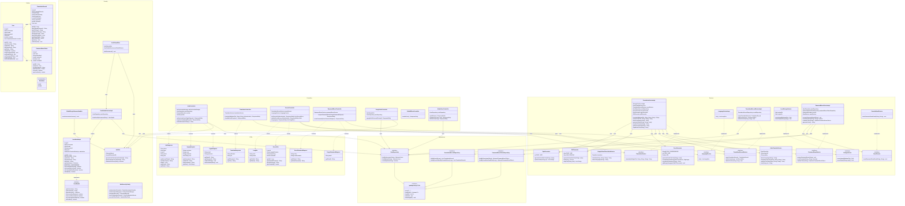

# 📐 Diagrama de Classes - Backend Java

## Visualização do Diagrama

```mermaid
classDiagram
    %% ===== ENTITIES =====
    namespace Entities {
        class User {
            -Long id
            -String username
            -String email
            -String password
            -String role
            -boolean enabled
            -List~TranslationRecord~ records
            +getId() Long
            +getUsername() String
            +getEmail() String
            +getPassword() String
            +getRole() String
            +isEnabled() boolean
            +setUsername(String) void
            +setEmail(String) void
            +setPassword(String) void
            +setRole(String) void
            +setEnabled(boolean) void
        }

        class TranslationRecord {
            -Long id
            -String originalFilename
            -String fileType
            -String detectedLang
            -String targetLang
            -Long fileSizeBytes
            -String outputPath
            -Instant createdAt
            -User user
            +getId() Long
            +getOriginalFilename() String
            +getFileType() String
            +getDetectedLang() String
            +getTargetLang() String
            +getFileSizeBytes() Long
            +getOutputPath() String
            +getCreatedAt() Instant
            +getUser() User
            +setUser(User) void
        }

        class PasswordResetToken {
            -Long id
            -User user
            -String tokenHash
            -Instant expiresAt
            -boolean used
            -Instant createdAt
            +getId() Long
            +getUser() User
            +getTokenHash() String
            +getExpiresAt() Instant
            +isUsed() boolean
            +getCreatedAt() Instant
        }

        class RoleName {
            <<enumeration>>
            USER
            ADMIN
        }
    }

    %% ===== REPOSITORIES =====
    namespace Repositories {
        class JpaRepository~T, ID~ {
            <<interface>>
            +save(T) T
            +findById(ID) Optional~T~
            +findAll() List~T~
            +delete(T) void
            +deleteById(ID) void
        }

        class UserRepository {
            <<interface>>
            +findByUsername(String) Optional~User~
            +findByEmail(String) Optional~User~
            +existsByEmail(String) boolean
        }

        class TranslationRecordRepository {
            <<interface>>
            +findByUserId(Long) List~TranslationRecord~
            +findByUserIdOrderByCreatedAtDesc(Long) List~TranslationRecord~
        }

        class PasswordResetTokenRepository {
            <<interface>>
            +findByTokenHash(String) Optional~PasswordResetToken~
            +findByUserIdAndUsedFalse(Long) Optional~PasswordResetToken~
        }
    }

    %% ===== DTOs =====
    namespace DTOs {
        class SigninRequest {
            -String email
            -String password
            +getEmail() String
            +getPassword() String
            +setEmail(String) void
            +setPassword(String) void
        }

        class SignupRequest {
            -String username
            -String email
            -String password
            -Set~String~ role
            +getUsername() String
            +getEmail() String
            +getPassword() String
            +getRole() Set~String~
        }

        class JwtResponse {
            -String token
            -String type
            -Long id
            -String email
            -String role
            +getAccessToken() String
            +getTokenType() String
            +getId() Long
            +getEmail() String
            +getRole() String
        }

        class TranslateResponse {
            -String filename
            -String url
            +getFilename() String
            +getUrl() String
        }

        class RecordDto {
            -Long id
            -String originalFilename
            -String targetLang
            -Instant createdAt
            +getId() Long
            +getOriginalFilename() String
            +getTargetLang() String
            +getCreatedAt() Instant
        }

        class LangDto {
            -String code
            -String name
            +getCode() String
            +getName() String
        }

        class ForgotPasswordRequest {
            -String email
            +getEmail() String
        }

        class ResetPasswordRequest {
            -String token
            -String newPassword
            +getToken() String
            +getNewPassword() String
        }
    }

    %% ===== SECURITY =====
    namespace Security {
        class UserDetails {
            <<interface>>
            +getUsername() String
            +getPassword() String
            +getAuthorities() Collection
            +isAccountNonExpired() boolean
            +isAccountNonLocked() boolean
            +isCredentialsNonExpired() boolean
            +isEnabled() boolean
        }

        class UserDetailsImpl {
            -Long id
            -String username
            -String email
            -String password
            -String role
            -Collection~GrantedAuthority~ authorities
            +getId() Long
            +getUsername() String
            +getEmail() String
            +getPassword() String
            +getRole() String
            +getAuthorities() Collection
            +build(User) UserDetailsImpl$
            +isAccountNonExpired() boolean
            +isAccountNonLocked() boolean
            +isCredentialsNonExpired() boolean
            +isEnabled() boolean
        }

        class JwtUtils {
            -String jwtSecret
            -long jwtExpirationMs
            +generateJwtToken(UserDetailsImpl) String
            +getUsernameFromJwt(String) String
            +validateJwtToken(String) boolean
        }

        class AuthTokenFilter {
            -JwtUtils jwtUtils
            -UserDetailsService userDetailsService
            +doFilterInternal() void
        }

        class WebSecurityConfig {
            +authenticationProvider() DaoAuthenticationProvider
            +authenticationManager() AuthenticationManager
            +passwordEncoder() PasswordEncoder
            +corsConfigurationSource() CorsConfigurationSource
            +securityFilterChain() SecurityFilterChain
        }

        class OAuth2LoginSuccessHandler {
            +onAuthenticationSuccess() void
        }

        class UserDetailsServiceImpl {
            -UserRepository userRepository
            +loadUserByUsername(String) UserDetails
        }
    }

    %% ===== CONTROLLERS =====
    namespace Controllers {
        class AuthController {
            -AuthenticationManager authenticationManager
            -UserRepository userRepository
            -PasswordEncoder encoder
            -JwtUtils jwtUtils
            +authenticateUser(SigninRequest) ResponseEntity
            +registerUser(SignupRequest) ResponseEntity
            -sanitizeRole(Set~String~) String
        }

        class TranslationController {
            -TranslationService translationService
            +translate(MultipartFile, String, String, Authentication) ResponseEntity
            +handleError(Exception) ResponseEntity
        }

        class RecordController {
            -TranslationRecordService recordService
            -LanguageService languageService
            +listRecords(Authentication) ResponseEntity~List~RecordDto~~
            +deleteRecord(Long, Authentication) ResponseEntity~Void~
            +languages() ResponseEntity~List~LangDto~~
        }

        class PasswordResetController {
            -PasswordResetService passwordResetService
            +requestPasswordReset(ForgotPasswordRequest) ResponseEntity
            +resetPassword(ResetPasswordRequest) ResponseEntity
        }

        class GoogleAuthController {
            -JwtUtils jwtUtils
            -UserRepository userRepository
            +googleAuthSuccess(Principal) ResponseEntity
        }

        class OAuth2ErrorController {
            +handleError() ResponseEntity
        }

        class AdminUserController {
            -UserRepository userRepository
            +getAllUsers() ResponseEntity
            +updateUser(Long, User) ResponseEntity
            +deleteUser(Long) ResponseEntity
        }
    }

    %% ===== SERVICES =====
    namespace Services {
        class TranslationService {
            <<interface>>
            +translate(MultipartFile, String, String, String) String
        }

        class TranslationServiceImpl {
            -StorageService storage
            -LibreTranslateService mt
            -TranslationRecordService recordService
            -UserRepository userRepository
            -DocxGenerator docxGenerator
            -PptxGenerator pptxGenerator
            -PdfGenerator pdfGenerator
            +translate(MultipartFile, String, String, String) String
            -extractText(Path, String, String) String
            -detectLanguage(String) String
            -generateOutput(String, String) byte[]
            -sanitizeFilename(String) String
            -getExtensionSafe(String) String
            -mapMimeToExt(String) String
        }

        class LibreTranslateService {
            -RestClient http
            -String baseUrl
            -String apiKey
            +detectLanguage(String) String
            +translateLargeText(String, String, String) String
            +splitAndTranslate(String, String, String) String
            -trim(String, int) String
        }

        class GoogleCloudTranslationService {
            -Translator translator
            +translate(String, String, String) String
            +detectLanguage(String) String
        }

        class LanguageService {
            <<interface>>
            +list() List~LangDto~
        }

        class LanguageServiceImpl {
            +list() List~LangDto~
        }

        class TranslationRecordService {
            <<interface>>
            +save(TranslationRecord) TranslationRecord
            +listForUser(Long) List~RecordDto~
            +deleteForUser(Long, Long) void
        }

        class TranslationRecordServiceImpl {
            -TranslationRecordRepository recordRepository
            +save(TranslationRecord) TranslationRecord
            +listForUser(Long) List~RecordDto~
            +deleteForUser(Long, Long) void
        }

        class DocxGenerator {
            -String[] FONT_PREFERENCES
            -int FONT_SIZE
            -Pattern URL
            +generateFromPlainText(String) byte[]
            -createBulletNumbering(XWPFDocument) BigInteger
            -normalizeWhitespace(String) String
            -addEmptyParagraph(XWPFDocument) void
        }

        class PdfGenerator {
            -float FONT_SIZE
            -float LINE_SPACING
            +generateFromPlainText(String) byte[]
            -loadFont() PDFont
            -wrapText(String, float) List~String~
        }

        class PptxGenerator {
            -int FONT_SIZE
            +generateFromPlainText(String) byte[]
            -splitIntoSlides(String, int) List~String~
        }

        class StorageService {
            <<interface>>
            +saveUpload(MultipartFile) Path
            +saveOutput(String, byte[]) Path
        }

        class LocalStorageService {
            -Path uploadDir
            -Path outputDir
            +saveUpload(MultipartFile) Path
            +saveOutput(String, byte[]) Path
        }

        class PasswordResetService {
            <<interface>>
            +requestPasswordReset(String) void
            +resetPassword(String, String) boolean
            +validateToken(String) Optional~PasswordResetToken~
        }

        class PasswordResetServiceImpl {
            -UserRepository userRepository
            -PasswordResetTokenRepository passwordResetTokenRepository
            -PasswordEncoder encoder
            -EmailService emailService
            +requestPasswordReset(String) void
            +resetPassword(String, String) boolean
            +validateToken(String) Optional~PasswordResetToken~
            -generateToken() String
        }

        class EmailService {
            <<interface>>
            +sendPasswordResetEmail(String, String) void
        }

        class ConsoleEmailService {
            +sendPasswordResetEmail(String, String) void
        }
    }

    %% ===== ENTITY RELATIONSHIPS =====
    User "1" --> "*" TranslationRecord : owns
    User "1" --> "*" PasswordResetToken : has

    %% ===== REPOSITORY INHERITANCE =====
    UserRepository --|> JpaRepository~T, ID~
    TranslationRecordRepository --|> JpaRepository~T, ID~
    PasswordResetTokenRepository --|> JpaRepository~T, ID~

    %% ===== SECURITY IMPLEMENTATIONS =====
    UserDetailsImpl ..|> UserDetails : implements
    UserDetailsServiceImpl --> UserRepository : uses
    UserDetailsServiceImpl --> UserDetailsImpl : creates

    %% ===== SERVICE IMPLEMENTATIONS =====
    TranslationServiceImpl ..|> TranslationService : implements
    LanguageServiceImpl ..|> LanguageService : implements
    TranslationRecordServiceImpl ..|> TranslationRecordService : implements
    LocalStorageService ..|> StorageService : implements
    PasswordResetServiceImpl ..|> PasswordResetService : implements
    ConsoleEmailService ..|> EmailService : implements

    %% ===== CONTROLLER DEPENDENCIES =====
    AuthController --> UserRepository : uses
    AuthController --> JwtUtils : uses
    TranslationController --> TranslationService : uses
    RecordController --> TranslationRecordService : uses
    RecordController --> LanguageService : uses
    PasswordResetController --> PasswordResetService : uses
    GoogleAuthController --> JwtUtils : uses
    GoogleAuthController --> UserRepository : uses
    AdminUserController --> UserRepository : uses

    %% ===== SERVICE DEPENDENCIES =====
    TranslationServiceImpl --> StorageService : uses
    TranslationServiceImpl --> LibreTranslateService : uses
    TranslationServiceImpl --> TranslationRecordService : uses
    TranslationServiceImpl --> UserRepository : uses
    TranslationServiceImpl --> DocxGenerator : uses
    TranslationServiceImpl --> PdfGenerator : uses
    TranslationServiceImpl --> PptxGenerator : uses
    TranslationRecordServiceImpl --> TranslationRecordRepository : uses
    PasswordResetServiceImpl --> UserRepository : uses
    PasswordResetServiceImpl --> PasswordResetTokenRepository : uses
    PasswordResetServiceImpl --> EmailService : uses

    %% ===== SECURITY DEPENDENCIES =====
    AuthTokenFilter --> JwtUtils : uses
    AuthTokenFilter --> UserDetailsServiceImpl : uses
    OAuth2LoginSuccessHandler --> JwtUtils : uses

    %% ===== DTO USAGE =====
    AuthController ..> SigninRequest : receives
    AuthController ..> SignupRequest : receives
    AuthController ..> JwtResponse : returns
    TranslationController ..> TranslateResponse : returns
    RecordController ..> RecordDto : returns
    RecordController ..> LangDto : returns
    PasswordResetController ..> ForgotPasswordRequest : receives
    PasswordResetController ..> ResetPasswordRequest : receives
```

## Notas sobre o Diagrama

### Estrutura do Sistema

O backend está organizado em camadas seguindo o padrão MVC com Spring Boot:

- **Entities**: Modelos de domínio (User, TranslationRecord, PasswordResetToken)
- **Repositories**: Camada de acesso a dados usando Spring Data JPA
- **DTOs**: Objetos de transferência de dados para requisições/respostas da API
- **Security**: Configuração de segurança com JWT e OAuth2
- **Controllers**: Endpoints REST da API
- **Services**: Lógica de negócio e serviços

### Principais Fluxos

1. **Autenticação**: AuthController → UserRepository → JwtUtils → JwtResponse
2. **Tradução**: TranslationController → TranslationService → LibreTranslate → DocxGenerator/PdfGenerator/PptxGenerator
3. **Recuperação de Senha**: PasswordResetController → PasswordResetService → EmailService

### Relacionamentos

- **User** possui múltiplos **TranslationRecords** (1:N)
- **User** possui múltiplos **PasswordResetTokens** (1:N)
- Todos os repositories estendem **JpaRepository** para operações CRUD
- Services implementam interfaces para facilitar testes e manutenção

