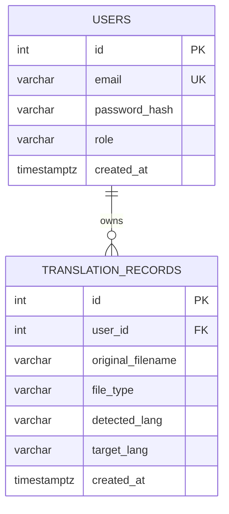

## ERD

```mermaid
erDiagram
  USERS {
    int id PK
    varchar email UK
    varchar password_hash
    varchar role
    timestamptz created_at
  }

  TRANSLATION_RECORDS {
    int id PK
    int user_id FK
    varchar original_filename
    varchar file_type
    varchar detected_lang
    varchar target_lang
    timestamptz created_at
  }

  USERS ||--o{ TRANSLATION_RECORDS : "owns"
```
