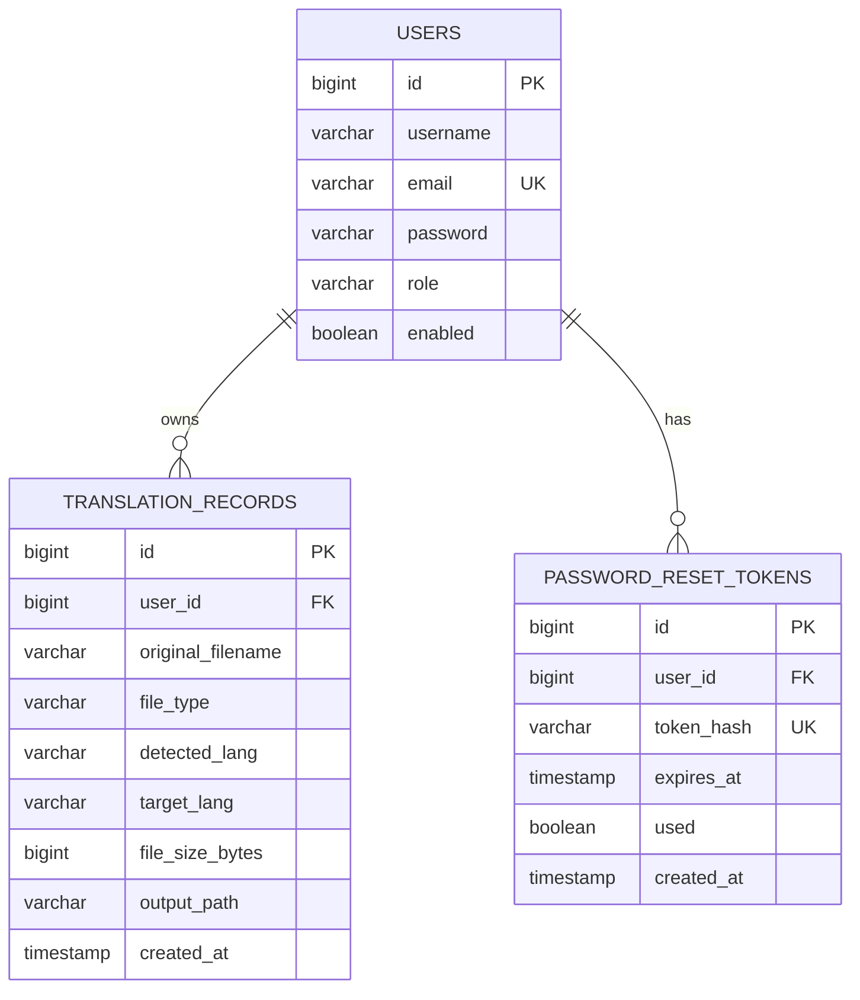

## ERD

```mermaid
erDiagram
  USERS {
    bigint id PK
    varchar username
    varchar email UK
    varchar password
    varchar role
    boolean enabled
  }

  TRANSLATION_RECORDS {
    bigint id PK
    bigint user_id FK
    varchar original_filename
    varchar file_type
    varchar detected_lang
    varchar target_lang
    bigint file_size_bytes
    varchar output_path
    timestamp created_at
  }

  PASSWORD_RESET_TOKENS {
    bigint id PK
    bigint user_id FK
    varchar token_hash UK
    timestamp expires_at
    boolean used
    timestamp created_at
  }

  USERS ||--o{ TRANSLATION_RECORDS : "owns"
  USERS ||--o{ PASSWORD_RESET_TOKENS : "has"
```
